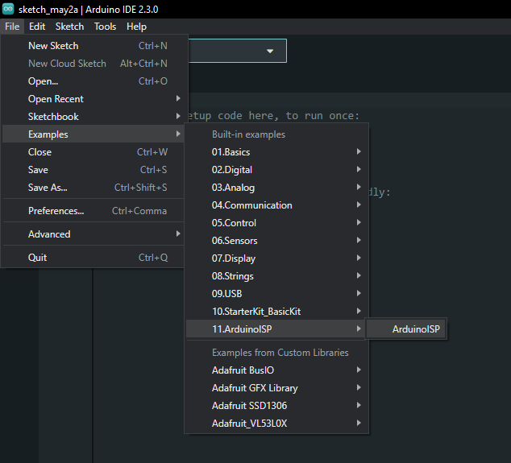
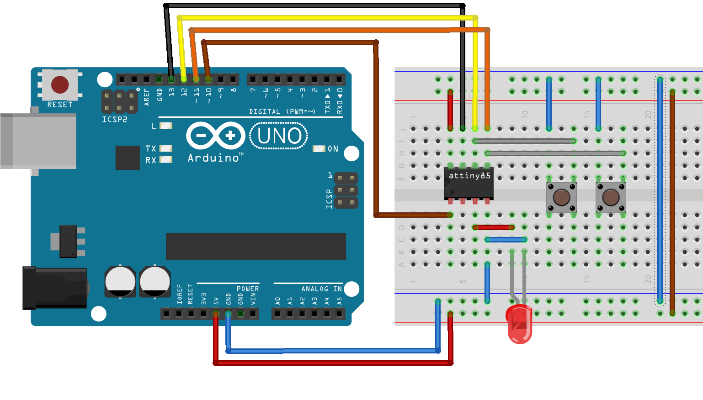

ATtiny85 mynn POC 
==

Proof of concept for using my hobby built [mynn](https://github.com/jasonalexander-ja/mynn) neural network library on an ATtiny85. 

Simple pre-defined model approximating the output of a XOR gate, feeding it data read from input pins and assigning the output pins based on the output of the network. 

## Build Instructions
1. Install prerequisites as described in the [avr-hal readme](https://github.com/jasonalexander-ja/mynn-attiny-example) (`avr-gcc`, `avr-libc`, `avrdude`).

2. Run `cargo build --release` to build the firmware.

3. Use an Arduino as an ISP to upload your firmware: 
   * Connect your AVR based Arduino to your PC, opening the Arduino IDE, select the correct port and Arduino board then open the example sketch File -> Examples -> 11.ArduinoISP -> ArduinoISP and upload it. 
   
   
   * Take note of what port your arduino is on 

4. Create your circuit: 
   * Arduino ISP circuit (used for programming):
      * Arduino pin 13 -> ATtiny85 pin 7
      * Arduino pin 12 -> ATtiny85 pin 6
      * Arduino pin 11 -> ATtiny85 pin 5
      * Arduino pin 10 -> ATtiny85 pin 1
   * Arduino 5V -> ATtiny pin 8
   * Arduino GND -> ATtiny pin 4
   * LED between pin 3 and pin 4 (GND) on the ATtiny85 (optional resistor) 
   * Jumper wires on pins 5 & 6 on the ATtiny85 (these are you 2 XOR inputs)
   

5. With `avrdude` installed, upload using the following command: 

```
avrdude -c arduino_as_isp -p t85 -P [serial port of arduino] -U flash:w:"target/avr-attiny85/release/[executable name].elf":a
```

## Operation 

When you connect either pin 5 or 6 to ground, the LED should turn on, when they are both connected or disconected to ground the LED will turn off, this is because the program is running a constant loop reading the 2 inputs through a neural network trained to approximate a XOR gate (turns on when both of it's inputs are different) and then assigning the output pin based on it's approximated result. 


